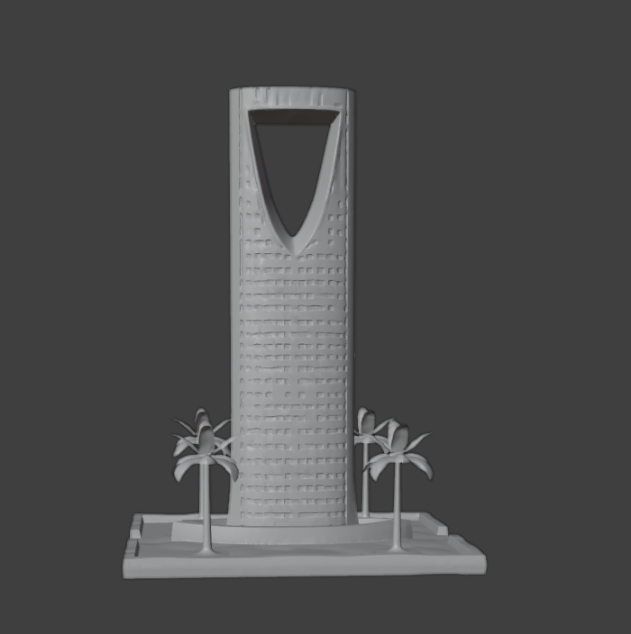
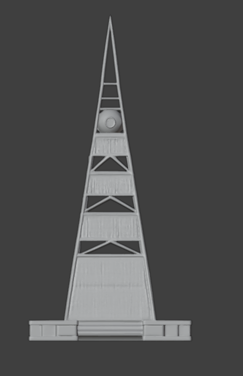
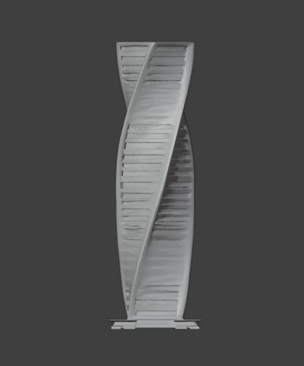

# 3D Riyadh Towers Project

## About
A collection of meticulously crafted 3D models showcasing Riyadh's most iconic architectural landmarks. Each tower has been modeled with precise attention to detail, capturing the unique architectural elements that make these structures famous worldwide.

## Featured Towers

### Kingdom Tower (Burj Al-Mamlaka)

The Kingdom Tower, also known as Burj Al-Mamlaka, stands as one of Riyadh's most recognizable landmarks. This 3D model captures the tower's distinctive opening at the top and its unique architectural features.

- **Model Format**: Available in multiple 3D formats
- **Textures**: High-resolution PBR materials
- **Poly Count**: Optimized for real-time applications
- **File Location**: [`models/kingdom-tower.zip`](models/kingdom-tower.zip)

### Al-Faisaliah Tower

The Al-Faisaliah Tower was the first skyscraper built in Saudi Arabia and features a distinctive ball-shaped top housing a restaurant with panoramic views. This model accurately reproduces the tower's unique silhouette and architectural details.

- **Model Format**: Available in multiple 3D formats
- **Textures**: High-resolution PBR materials
- **Poly Count**: Optimized for real-time applications
- **File Location**: [`models/al-faisaliah%20tower.zip`](models/al-faisaliah-tower.zip)

### Flip Tower

The Flip Tower model showcases another remarkable architectural marvel in Riyadh, with its distinctive design and innovative structural elements.

- **Model Format**: Available in multiple 3D formats
- **Textures**: High-resolution PBR materials
- **Poly Count**: Optimized for real-time applications
- **File Location**: [`models/flibed-tower.zip`](models/flibed-tower.zip)

## Technical Specifications

### Modeling Software Used
- Blender 3.0+
- Maya 2023
- ZBrush 2022

### Export Formats
- FBX
- OBJ
- GLTF/GLB
- Blender Native (.blend)

### Optimization
All models have been carefully optimized for real-time applications while maintaining visual fidelity. They are suitable for:
- AR/VR applications
- Mobile platforms
- Real-time rendering
- Snapchat Lens integration

For detailed technical specifications, please see the [technical documentation](docs/technical_specifications.md).

## Snapchat Integration
These models have been specifically optimized for use with Snapchat Lens Studio, following all best practices for mobile AR performance. For integration details and examples of how these models can be used in Snapchat Lenses, please refer to the [Snapchat Integration Guide](docs/snapchat_integration.md).

## Usage
These models are ideal for:
- Architectural visualization
- AR experiences
- Mobile applications
- Educational content
- Video game environments
- Snapchat Lenses

## Creator Information
These models were created by [Your Name], a 3D architectural specialist focusing on landmark recreations and AR/VR experiences. With expertise in photorealistic rendering and optimization for mobile platforms, I create content that balances visual quality with technical performance.

## Contact
For collaboration inquiries or custom 3D architectural models:
- **linkedin**: [https://www.linkedin.com/in/bandar-al-otibie/]
- **Portfolio**: [https://bento.me/b0obe]
- **Snapchat**: [@b0obe]

## License
© [2025] [bandar]. All rights reserved.
These 3D models are provided for viewing and evaluation purposes only. Commercial use, redistribution, or modification requires explicit written permission. 